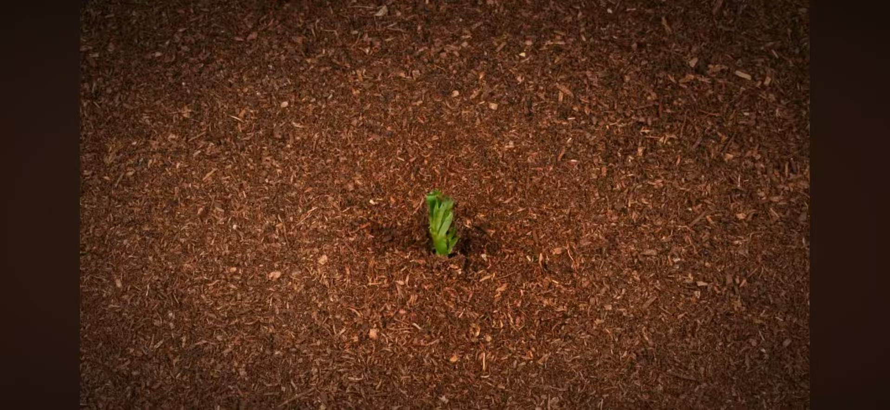
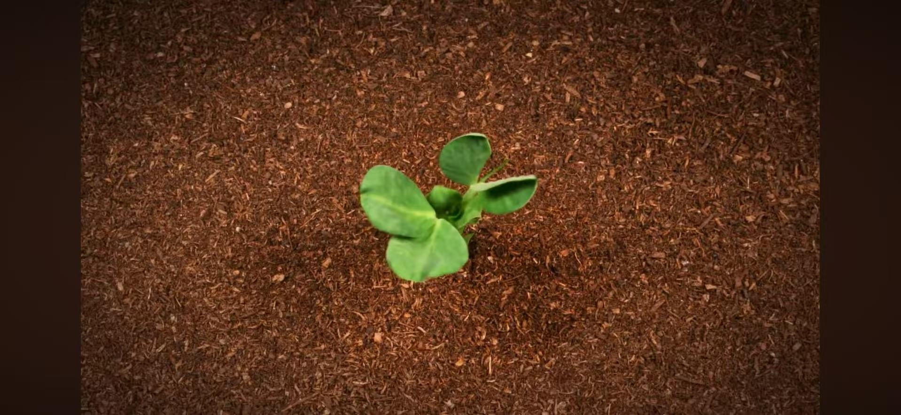
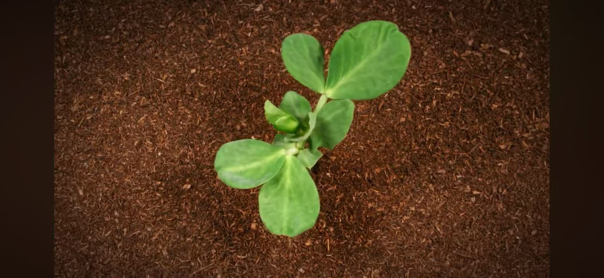

# Creative Coding Major Project
Qianqian's individual part
## How to Interact with the Work
My artwork is created **a time-based animated** in p5.js.
There is **no mouse or keyboard interaction required**. 
Because many components use randomness, **each refresh presents new colors and pattern variations**, making every viewing unique.
# My Individual Approach to Animation
For my individual project, I chose **time-based animation** as my core technique.
Inspired by the natural growth of plants (see below), I hope my work can unfold layer by layer slowly, just like a seed growing into a plant. My version is completely different from the group code. In my works, evolution is entirely controlled by time, sequence and process, without the need for user interaction. Viewers only need to watch the visual changes. Group code displays all elements in real time and statically.
## Visual Inspiration
My animation inspiration comes from time-lapse videos of plant growth [Inspiration Video](https://youtu.be/5ahgRYIXUus?si=KsOHmxrZRTbmo4fS)

Seed germination  Seed growth Seed maturity
The video shows the process of a seed sprouting and unfolding its leaves in stages. I incorporated this natural growth rhythm into my animation production. The circles presented in sequence from the inside to the center and then to the outside symbolize the process of life sprouting from the soil to maturity. The extension of the connecting lines over time symbolizes the gradual growth of roots and stems during the plant's growth process. The loop playback of the animation symbolizes the cycle of life. Meanwhile, I want to reproduce the process of the tribal culture's prosperity and development over time through this natural growth rhythm.
### Part1: The animation of the main circular pattern
Each circle in my artworks is composed of three generating layers: **Inner layer、Middle layer、Outer layer**.

In the original group code, these layers are static and are drawn immediately. In my personal version, I set the growth time and duration for each layer of the circle. To present an effect similar to **Send germination**: the circle grows from the seed (inside) into a fully developed shape (outside).
### Part2: Line animations connecting circles
In the original group code, the lines connecting the circles are static. I set them to start drawing from different times and extend from the starting point to the ending point as time changes.
## Technical Overview
I introduced a time-based system into the group code by giving each circle and each line its own animation schedule.

* Track animation time: millis() [Code Source](https://p5js.org/reference/p5/millis/)

The animation runs on a 15-second loop:
1. First half: growth (0 → 1)

2. Second half: rewind (1 → 0)

* Gradually draw lines and shapes: lerp() [Code Source](https://p5js.org/reference/p5/lerp/)
## Key Techniques
* Layered time control for each circle
* Staggered line animation using lerp()
* Looped master animation using millis()
* Easing for natural motion
* Mask buffer circle to preserve visual clarity
## External Code / Techniques:
I used these concepts commonly found in p5.js animations:
* Time-based animation using millis()
* Smooth progressive line extension using lerp()
These methods are general p5.js animation approaches.
# References & Acknowledgments
* Core structure based on the group project scaffold
* Use the millis () and lerp () documentation of p5.js to support the animation part.
* The main code is derived from classroom materials. 
* Inspiration from plant time-lapse videos.
* Conceptually influenced by the ideas of indigenous art and culture.